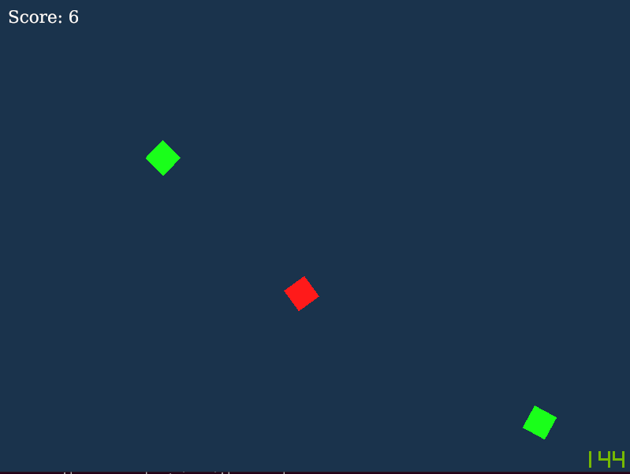

# Zombie Squares: Rust Edition
Zombie Squares is a game that I create over and over to test out new platforms
due to it's simplicity. A player must fight off an endless wave of zombies. This
time, it's in Rust, using the library [ggez](https://ggez.rs).

It turned out pretty well for a first shot. Looking to work on more Rust
projects in the future. The tooling is much better than C and C++.

## Running it
With the latest version of Rust installed, simply run `cargo run` in the project
directory.

## Screenshots

